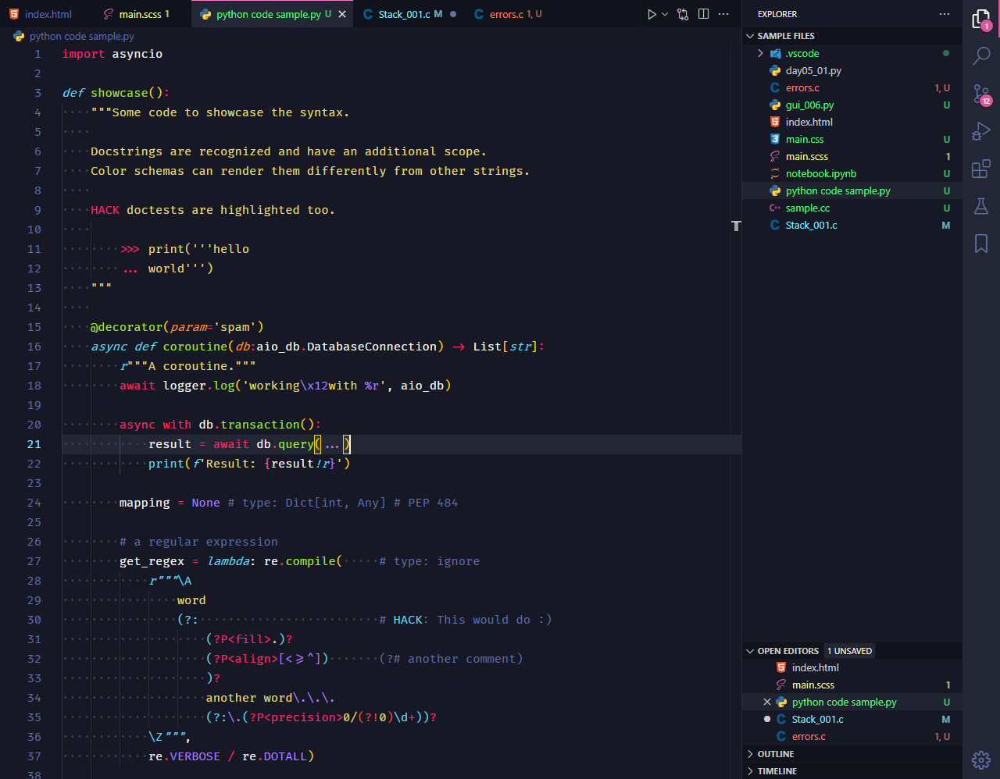

# Sweet Dracula Monokai

**Sweet Dracula Monokai** - PROxZIMA's [Sweet Dracula theme](https://github.com/PROxZIMA/sweet-dracula) with small visibility improvements and Monokai-style syntax highlighting.

## VSCode Screenshot

## Font Settings in Screenshot

Font used: [Fira Code](https://github.com/tonsky/FiraCode) with ligatures.

    "editor.fontFamily": "Fira Code",
    "editor.fontLigatures": "'ss03', 'ss07', 'ss09', 'ss10', 'cv14', 'cv25', 'cv26', 'cv27', 'cv32'",
    "editor.fontSize": 15,
    "editor.fontWeight": "400",
    "editor.lineHeight": 25

---

Please let me know if you have spotted a pink `(FF00FF)` element, as I could not find all matching UI elements for every attribute I changed.

Send me feedback on [GitHub](https://github.com/LEFD/sweetdracula-monokai).
