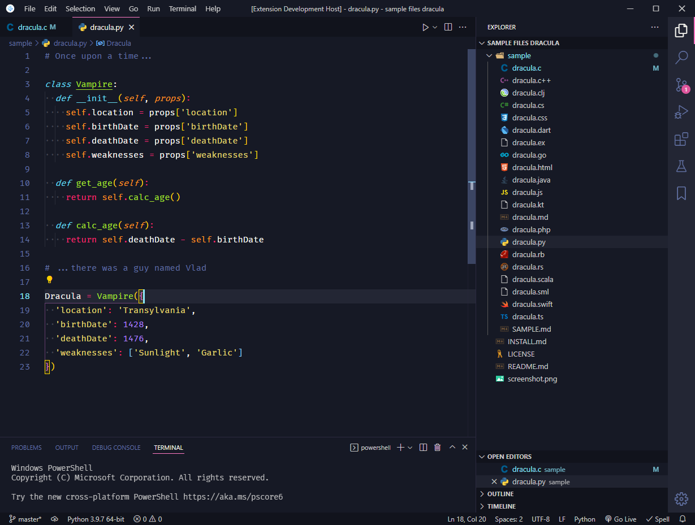

# Sweet Dracula Monokai

[](https://vscode.dev/theme/lefd.sweetdracula-monokai)

[](https://marketplace.visualstudio.com/items?itemName=lefd.sweetdracula-monokai)
[](https://marketplace.visualstudio.com/items?itemName=lefd.sweetdracula-monokai)
[](https://marketplace.visualstudio.com/items?itemName=lefd.sweetdracula-monokai)
[](https://open-vsx.org/extension/lefd/sweetdracula-monokai)

**Sweet Dracula Monokai** - PROxZIMA's [Sweet Dracula theme](https://github.com/PROxZIMA/sweet-dracula) with small visibility improvements and Monokai-style syntax highlighting.

## VSCode Screenshot



## Editor Settings in Screenshot

Font used: [Fira Code](https://github.com/tonsky/FiraCode) with ligatures.

```json
"editor.fontFamily": "Fira Code",
"editor.fontLigatures": "'ss03', 'ss07', 'ss09', 'ss10', 'cv14', 'cv25', 'cv26', 'cv27', 'cv32'",
"editor.fontSize": 15,
"editor.fontWeight": "400",
"editor.lineHeight": 25,
"editor.bracketPairColorization.enabled": true,
"editor.guides.bracketPairs": "active",
"editor.guides.bracketPairsHorizontal": "active"
"editor.renderWhitespace": "boundary",
```

---

Please let me know if you have spotted a pink `(FF00FF)` element, as I could not find all matching UI elements for every attribute I changed.

Send me feedback on [GitHub](https://github.com/LEFD/sweetdracula-monokai).
