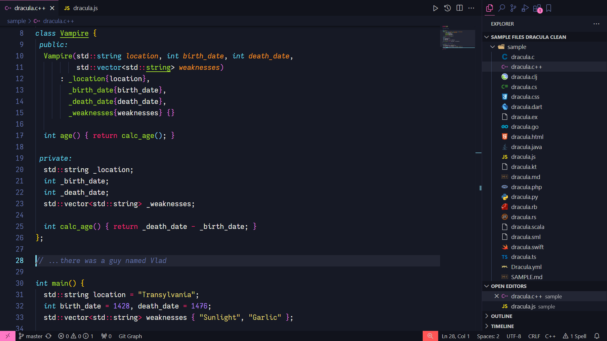

<h1 align="center">🎨 Sweet Dracula Monokai</h1>

<p align="center">
    <a title="Visual Studio Marketplace Version" href="https://marketplace.visualstudio.com/items?itemName=lefd.sweetdracula-monokai"></a>
    <a title="Visual Studio Marketplace Installs" href="https://marketplace.visualstudio.com/items?itemName=lefd.sweetdracula-monokai"></a>
    <a title="Visual Studio Marketplace Downloads" href="https://marketplace.visualstudio.com/items?itemName=lefd.sweetdracula-monokai"></a>
    <a title="Open VSX Downloads" href="https://open-vsx.org/extension/lefd/sweetdracula-monokai"></a>
</p>

<p align="center">
    <i><b>🌌 Dive into the midnight sky and lose yourself in coding all night long!</b></i>
</p>

<p align="center">
    A dark theme for VS Code combining a refined version of the iconic Dracula theme with classic Monokai-style syntax highlighting. Based on the beautiful <a href="https://github.com/PROxZIMA/sweet-dracula">Sweet Dracula theme</a> by PROxZIMA, it offers a vibrant and functional environment for a seamless programming experience.
    <br>
</p>

<p align="center">
    📦 Available for <a href="https://marketplace.visualstudio.com/items?itemName=lefd.sweetdracula-monokai">VS Code</a> and <a href="https://open-vsx.org/extension/lefd/sweetdracula-monokai">Code - OSS</a>
    <br><br>
    <a title="Preview Theme on vscode.dev" href="https://vscode.dev/theme/lefd.sweetdracula-monokai">
        
    </a>
</p>



## Installation

1. In VS Code, open the Extensions view (`Ctrl + Shift + X` / `⇧ ⌘ X`).
2. In the search box, type "Sweet Dracula Monokai".
3. Press "Install" and select "Sweet Dracula Monokai" from the Command Palette.

## Editor Settings

### Font and Icons

- Font used: [Iosevka Extended](https://github.com/be5invis/Iosevka), with custom stylistic set (see settings below)
- Icon theme: vscode-icons ([VS Marketplace](https://marketplace.visualstudio.com/items?itemName=vscode-icons-team.vscode-icons) - [Open VSX](https://open-vsx.org/extension/vscode-icons-team/vscode-icons) - [GitHub](https://github.com/vscode-icons/vscode-icons))

### VS Code Settings

```json
"editor.fontFamily": "Iosevka Expanded",
"editor.fontLigatures": "'ss05', 'calt' 0, 'dlig' 1, 'cv07' 2, 'cv10' 26, 'cv20' 10, 'cv44' 8, 'cv35' 2, 'cv60' 2, 'VSAL' 1, 'VLAD' 2",
"editor.fontSize": 15,
"editor.fontWeight": "400",
"editor.lineHeight": 25,
"terminal.integrated.fontFamily": "Iosevka Term Expanded",
"terminal.integrated.fontWeight": "400",
"terminal.integrated.fontSize": 14,
"debug.console.fontFamily": "Iosevka Expanded",
"editor.cursorWidth": 3,
"editor.guides.bracketPairs": "active",
"editor.guides.bracketPairsHorizontal": "active",
"editor.renderWhitespace": "trailing",
```

## Feedback

If you enjoy using Sweet Dracula Monokai, please consider to [rate the theme 5 stars](https://marketplace.visualstudio.com/items?itemName=lefd.sweetdracula-monokai&ssr=false#review-details) on the VS Code Marketplace.

Have you encountered any issues, have suggestions, or would like support for your favorite programming language? Please feel free to [open an issue on GitHub](https://github.com/LEFD/sweetdracula-monokai/issues/new). All forms of feedback are appreciated.
